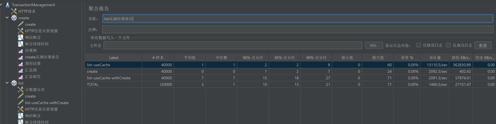
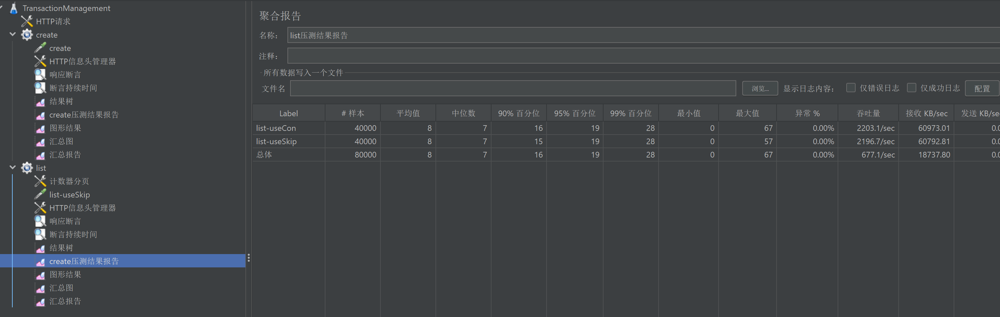

# Transaction Management System

## Project Overview

The **Transaction Management System** is a simple yet efficient in-memory transaction management module built using **Spring Boot 3.2.3**, **JDK 21**, and **Maven 3.9.9**. The system allows for transaction creation, querying, and updating, using a **`ConcurrentSkipListMap`** to ensure thread-safety and ordered traversal of transactions.

The system is designed to handle data efficiently, with performance optimization for high concurrency, including the use of **caching** to improve query speed.

Although the system focuses on transaction management, it has been designed with scalability in mind, allowing for potential future enhancements (such as implementing related entities like users, accounts, ledgers, etc.).

## Features

- **Transaction Creation**: Create transactions with various fields such as type, amount, status, and more.
- **Transaction Querying**: Supports paginated queries to retrieve transaction lists.
- **Transaction Update**: Allows for updating transaction statuses or other properties.
- **Transaction delete**: Implemented the logical deletion of transactions to ensure data security, without actually deleting the data.
- **Thread-Safe and Ordered Storage**: Transactions are stored in a **`ConcurrentSkipListMap`**, ensuring thread-safety and ordered access.
- **Caching**: When querying with the same parameters, the cached result is directly retrieved instead of querying again, which significantly improves query efficiency. And when the data changes (create/update/delete), the cache is invalidated.
- **Custom Business Exception**: Custom exceptions are thrown for business validation, ensuring proper error handling.

## Technical Stack

- **Backend**: Spring Boot 3.2.3, Spring MVC
- **Database**: In-memory data structure using **`ConcurrentSkipListMap`**
- **Caching**: Spring Cache
- **Build Tool**: Maven 3.9.9
- **Testing**: JUnit, MockMvc, JMeter
- **Containerization**: Docker


# Transaction Structure

The `Transaction` structure includes the following fields:

- **`id`**: A unique identifier for the transaction.
- **`type`**: The type of transaction (e.g., `DEPOSIT`, `WITHDRAWAL`).
- **`category`**: The category of transaction (e.g., `CASH`, `TRANSFER_IN`, `REPAYMENT_REFUND`). `TransactionType` and `TransactionCategory` are related to define the nature of the transaction.
  `TRANSFER_IN` could only be associated with the category `DEPOSIT`, and `TRANSFER_OUT` could only be associated with the category `DEPOSIT`, `CASG` could  be associated with the both.
- **`status`**: The current status of the transaction (e.g., `PENDING`, `COMPLETED`).
- **`amount`**: The monetary amount of the transaction. It cannot be negative.
- **`description`**: A brief description of the transaction.
- **`primaryAccount`**: The account associated with the transaction.
- **`counterpartyAccount`**: Required to record the corresponding account involved in the transfer when the transaction category is `TRANSFER_IN` or `TRANSFER_OUT`. This design provides better scalability for adding more entities in the future.


## Custom Business Exceptions

The system uses custom exceptions to handle business logic validation. For instance, if deleting a non-existent transaction, an `TransactionException` will be thrown, with the `ErrorCode` field set to `TRANSACTION_NOT_FOUND`.

## Data Consistency Considerations

This system handles transactions at a basic level. While transfers between accounts are a common use case in financial systems, 
we have simplified the implementation to focus solely on transaction management within a single entity. To fully support transfers, 
you would need to create additional entities such as:`User`,`Account`,`Asset Freeze`,`Ledger`. Implementing these would require handling additional complexities such as ensuring data consistency across multiple entities. This module is designed as an in-memory solution, and these additional features are not yet implemented.

## Performance and Stress Testing

The system has been stress-tested and the following results:

- As show in the following figure(1 million records have already been created.).
  
  - **Create Transaction**:
    - 99% percentile: 2ms with 12 threads.
  - **List Transactions (No Cache)**:
    - 99% percentile: 28ms.
  - **List Transactions (With Cache)**:
    - 99% percentile: 9ms (Significant performance improvement with caching).
    However, in scenarios where frequent transaction create/update occurs, the cache may expire frequently, limiting the benefit of caching.

- Additionally, out of personal curiosity, I compared the performance of ConcurrentHashMap and ConcurrentSkipMap under stress testing.
  
  - Based on the results (as shown in the figure), their performance in memory appears to be essentially the same.
  - In the end, ConcurrentSkipMap of providing sorting functionality was chosen.


## Stress Test Machine Specs
- **JVM Parameters**:
  ```bash
  -Xms128m 
  -Xmx1024m 
  -XX:ReservedCodeCacheSize=512m 
  -XX:SoftRefLRUPolicyMSPerMB=50 
  -XX:CICompilerCount=2 

